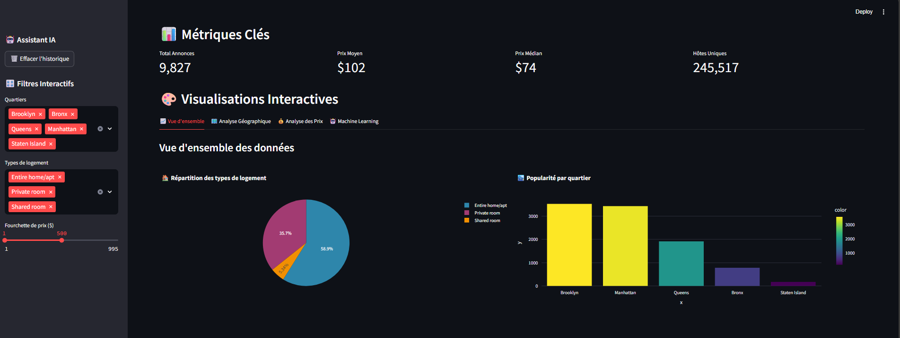
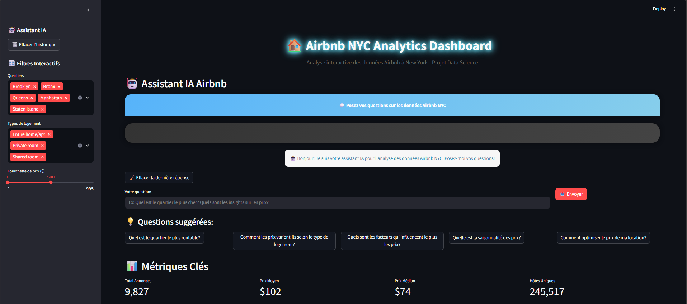
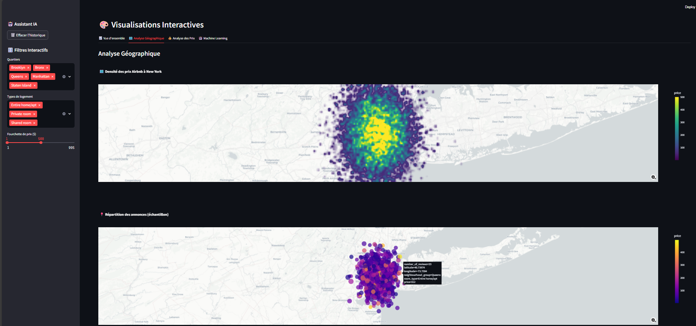
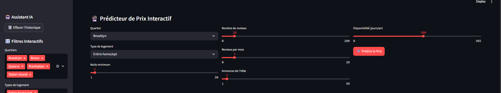

# 🏠 Airbnb NYC Analytics Dashboard with Chatbot AI

<div align="center">


**🚀 De la donnée à la décision : Analyse interactive des locations Airbnb à New York avec un CHATBOT IA**

[🎯 Demo Live](#demo) • [📊 Features](#features) • [⚡ Installation](#installation) • [🤖 IA Assistant](#ia-assistant)

---

### 🌟 **Transformez les données Airbnb en insights exploitables avec notre dashboard interactif et notre assistant IA intégré !**

</div>

## 👥 Équipe

<div align="center">

| 👩‍💻 **Carolina HENAO URIBE** | 👨‍💻 **Marwane ZAIM SASSI** |
|:---:|:---:|
| Data Scientist | Data Scientist |
| 🔬 ML Engineering | 🎨 Data Visualization |

</div>


## 🎯 Aperçu du Projet

> **Découvrez les secrets du marché Airbnb new-yorkais à travers une plateforme d'analyse interactive propulsée par l'IA !**

Notre dashboard transforme **48 895 annonces Airbnb** en insights exploitables grâce à :
- 🔍 **Analyse exploratoire approfondie** avec filtres dynamiques
- 🗺️ **Visualisations géographiques interactives** 
- 🤖 **Assistant IA conversationnel** pour des analyses sur-mesure
- 📊 **Modèles ML** pour prédire les prix des locations
- 💡 **Recommandations automatiques** basées sur les données

## 🎨 Aperçu Visuel

<div align="center">

### 🏠 **Dashboard Principal**

*Interface moderne avec métriques clés et filtres dynamiques*

### 🤖 **Assistant IA Intégré**

*Chatbot conversationnel avec LLaMA 3.1 70B*

### 🗺️ **Visualisations Géographiques**

*Cartes de densité et analyse spatiale des prix*

### 🔮 **Prédicteur ML**

*Modèles Random Forest et Decision Tree interactifs*

</div>

---

## 🎬 Démonstration Vidéo

<div align="center">

### 🚀 **Découvrez notre dashboard en action**


*🎥 Navigation complète : filtres, visualisations, IA et prédicteur ML*


---


</div>

### 🎪 **Pourquoi ce projet ?**

| Défi | Solution |
|------|----------|
| 📊 Données complexes à analyser | Interface intuitive avec filtres interactifs |
| 🗺️ Comprendre la géographie des prix | Cartes de densité et heatmaps dynamiques |
| 🤖 Questions spécifiques sur les données | Assistant IA conversationnel intégré |
| 💰 Prédire les prix optimaux | Modèles ML (Random Forest + Decision Tree) |


## 🔥 Fonctionnalités

### 🎛️ **Interface Interactive**
- ✨ **Dashboard moderne** avec thème sombre futuriste
- 🎚️ **Filtres dynamiques** (quartiers, types de logement, prix)
- 📱 **Design responsive** compatible mobile/desktop
- 🎨 **Animations fluides** et effets de verre

### 🤖 **Assistant IA Conversationnel**
- 💬 **Chat en temps réel** avec modèle LLaMA 3.1 70B
- 🧠 **Analyse contextuelle** des données filtrées
- 💡 **Suggestions automatiques** de questions pertinentes
- 📊 **Réponses avec insights** basées sur vos filtres actuels

### 📊 **Analyses Avancées**
- 🏙️ **Vue d'ensemble** : Métriques clés et distributions
- 🗺️ **Géolocalisation** : Cartes de densité et scatter plots
- 💰 **Analyse des prix** : Corrélations et heatmaps
- 🤖 **Machine Learning** : Prédictions et feature importance

## ⚡ Installation & Démarrage

### 🚀 **Démarrage Rapide (3 étapes)**

```bash
# 1️⃣ Cloner le projet
git clone https://github.com/marwane-zaim/airbnb-nyc-analytics
cd airbnb-nyc-analytics

# 2️⃣ Installer les dépendances
pip install -r requirements.txt

# 3️⃣ Lancer le dashboard
streamlit run Dashboard_FINAL.py
```

### 📦 **Pré-requis**

```bash
Python 3.8+
streamlit>=1.28.0
plotly>=5.0.0
pandas>=1.5.0
scikit-learn>=1.3.0
numpy>=1.21.0
seaborn>=0.11.0
matplotlib>=3.5.0
huggingface_hub>=0.16.0  # Pour l'assistant IA
```

### 🔧 **Configuration de l'Assistant IA**

Pour activer le chatbot IA, vous devez configurer votre clé API Nebius :

1. Obtenez votre clé API sur [Nebius](https://nebius.ai)
2. Remplacez la clé dans `Dashboard_FINAL.py` ligne 131
3. Relancez l'application

## 🤖 Assistant IA

### 💬 **Fonctionnalités du Chat**

Notre assistant IA propulsé par **LLaMA 3.1 70B** vous permet de :

- 🔍 **Poser des questions** sur les données en langage naturel
- 📊 **Obtenir des analyses** contextuelles basées sur vos filtres
- 💡 **Recevoir des recommandations** personnalisées
- 📈 **Comprendre les tendances** du marché Airbnb

### 🎯 **Questions d'Exemple**

```
💬 "Quel est le quartier le plus rentable ?"
💬 "Comment les prix varient-ils selon le type de logement ?"
💬 "Quels facteurs influencent le plus les prix ?"
💬 "Comment optimiser le prix de ma location ?"
```

## 📊 Analyses Disponibles

### 🏙️ **Vue d'Ensemble**
- 📈 **Métriques clés** : Total annonces, prix moyen/médian
- 🥧 **Répartition** des types de logement
- 📊 **Popularité** par quartier
- 💰 **Distribution** des prix avec statistiques

### 🗺️ **Analyse Géographique**
- 🌡️ **Heatmap** de densité des prix
- 📍 **Scatter plot** interactif des annonces
- 🎯 **Centrage automatique** sur NYC
- 🔍 **Zoom** et navigation fluide

### 💰 **Analyse des Prix**
- 🔥 **Heatmap** prix par quartier/type
- 📦 **Box plots** de distribution
- 🔗 **Matrice de corrélation** interactive
- 📊 **Comparaisons** multi-dimensionnelles

## 🧠 Machine Learning

### 🎯 **Modèles Disponibles**

| Modèle | Performance | Utilisation |
|--------|-------------|-------------|
| 🌲 **Random Forest** | MAE: ~54.13 | Prédiction robuste |
| 🌳 **Decision Tree** | MAE: ~58.21 | Interprétabilité |

### 🔮 **Prédicteur Interactif**

Testez nos modèles avec vos propres paramètres :
- 🏙️ Sélectionnez le quartier
- 🏠 Choisissez le type de logement  
- 🎚️ Ajustez les paramètres (nuits min, reviews, etc.)
- 🎯 **Obtenez une prédiction** instantanée !

### 📊 **Feature Importance**

Découvrez quelles variables influencent le plus les prix :
1. 🏠 **Type de logement** (room_type)
2. 🏙️ **Quartier** (neighbourhood_group)  
3. 📍 **Localisation** (latitude/longitude)
4. 📅 **Disponibilité** (availability_365)

## 📈 Visualisations

### 🎨 **Types de Graphiques**

- 📊 **Graphiques en barres** interactifs
- 🥧 **Camemberts** avec animations
- 🗺️ **Cartes** de densité et scatter
- 📦 **Box plots** et distributions
- 🔥 **Heatmaps** de corrélation
- 📈 **Graphiques** de régression ML

### 🎯 **Technologie Plotly**

- ⚡ **Rendu rapide** et fluide
- 🔍 **Zoom** et pan interactifs
- 💡 **Tooltips** informatifs
- 📱 **Responsive** design
- 🎨 **Palette** de couleurs moderne

### 📈 **Évolution du Projet**
## 🔄 **Versions du Dashboard**

| Version | Fichier | Description |
|--------|-------------|-------------|
| 🌲 **v1.0** | dashboard_app_Version1.py | Version prototype avec analyses de base |
| 🌳 **v2.0** | Dashboard_FINAL.py | Version finale avec assistant IA et ML intégré |


🚀 Améliorations v2.0

🤖 Assistant IA conversationnel avec LLaMA 3.1 70B
🎨 Interface modernisée avec thème sombre futuriste
🔮 Prédicteur ML interactif (Random Forest + Decision Tree)
📊 Visualisations avancées avec Plotly
🎚️ Filtres dynamiques améliorés

## 🛠️ Technologies

### 🐍 **Backend & Data**
- **Python 3.8+** - Langage principal
- **Pandas** - Manipulation des données
- **NumPy** - Calculs numériques
- **Scikit-learn** - Machine Learning
- **Streamlit** - Interface web

### 🎨 **Frontend & Visualisation**
- **Plotly** - Graphiques interactifs
- **Matplotlib/Seaborn** - Visualisations statiques
- **CSS/HTML** - Styling avancé
- **JavaScript** - Interactions

### 🤖 **Intelligence Artificielle**
- **Hugging Face** - API d'IA
- **LLaMA 3.1 70B** - Modèle de langage
- **Nebius** - Plateforme d'inférence


## 🔮 Prédicteur de Prix Interactif

### 🎯 **Fonctionnalité Phare : Machine Learning en Temps Réel**

Notre dashboard intègre un **prédicteur de prix intelligent** dans l'onglet "🤖 Machine Learning", permettant aux utilisateurs de tester différents scénarios en temps réel.

### ⚡ **Comment ça marche**

1. **Sélectionnez vos paramètres** via l'interface intuitive :
   - 🏙️ **Quartier** (Manhattan, Brooklyn, Queens, Bronx, Staten Island)
   - 🏠 **Type de logement** (Entire home/apt, Private room, Shared room)
   - 📅 **Nuits minimum** (1-365 jours)
   - ⭐ **Nombre de reviews** (0-629)
   - 📊 **Disponibilité annuelle** (0-365 jours)

2. **Obtenez une prédiction instantanée** avec :
   - 💰 **Prix prédit** par les deux modèles ML
   - 📈 **Comparaison** Random Forest vs Decision Tree
   - 🎯 **Intervalle de confiance** 

### 💡 **Cas d'Usage**

- **🏠 Propriétaires** : Optimiser le prix de leur location
- **💼 Investisseurs** : Évaluer la rentabilité potentielle
- **📊 Analystes** : Comprendre les facteurs de prix
- **🎓 Étudiants** : Explorer les concepts ML appliqués

### 🎨 **Interface Utilisateur**

L'interface du prédicteur offre :
- 🎚️ **Sliders interactifs** pour ajuster les paramètres
- 📊 **Visualisation temps réel** des prédictions
- 💡 **Tooltips explicatifs** pour chaque variable
- 🔄 **Mise à jour instantanée** des résultats


## 🔍 Méthodologie

### 1️⃣ **Acquisition & Nettoyage**
- 📥 Import du dataset Kaggle (48,895 annonces)
- 🧹 Suppression des valeurs aberrantes (prix = 0)
- 🔄 Traitement des types de données
- 📊 Validation et contrôle qualité

### 2️⃣ **Analyse Exploratoire**
- 📈 Étude des distributions
- 🔗 Analyse des corrélations
- 🗺️ Visualisation géographique
- 💡 Identification des patterns

### 3️⃣ **Machine Learning**
- 🎯 Définition du problème (régression)
- 🔧 Feature engineering
- 🤖 Entraînement des modèles
- 📊 Évaluation et validation

### 4️⃣ **Déploiement**
- 🚀 Interface Streamlit
- 🤖 Intégration de l'IA
- 🎨 Design et UX
- 📱 Tests et optimisation

## 📈 Résultats Clés

### 🏆 **Insights Principaux**

| 🔍 Découverte | 📊 Valeur | 💡 Impact |
|---------------|-----------|-----------|
| 🏙️ **Quartier le plus cher** | Manhattan | +50% vs autres quartiers |
| 🏠 **Type dominant** | Entire home/apt | 60% des annonces |
| 💰 **Prix médian** | $106/nuit | Référence marché |
| ⭐ **Reviews importantes** | Corrélation positive | Impact sur visibilité |

### 🎯 **Performance ML**

- 🌲 **Random Forest** : MAE ~54.13$ (meilleur modèle)
- 🌳 **Decision Tree** : MAE ~58.21$ 
- 📊 **R² Score** : ~0.165 (variabilité expliquée)
- 🎯 **Variables clés** : room_type, neighbourhood_group

### 💡 **Recommandations**

1. 🏠 **Investisseurs** : Privilégier Manhattan pour la rentabilité
2. 🏙️ **Hôtes** : Appartements entiers plus rentables
3. ⭐ **Marketing** : Encourager les reviews pour la visibilité
4. 📊 **Pricing** : Utiliser nos modèles pour l'optimisation


### 🎯 **Domaines d'Amélioration**
- 🤖 Nouveaux modèles ML
- 🎨 Améliorations UI/UX
- 📊 Nouvelles visualisations
- 🔍 Analyses supplémentaires
- 🌐 Internationalisation


<div align="center">

### 🌟 **Merci d'avoir consulté notre projet !**

---

**Développé avec ❤️ par Carolina HENAO URIBE & Marwane ZAIM SASSI**

</div>
